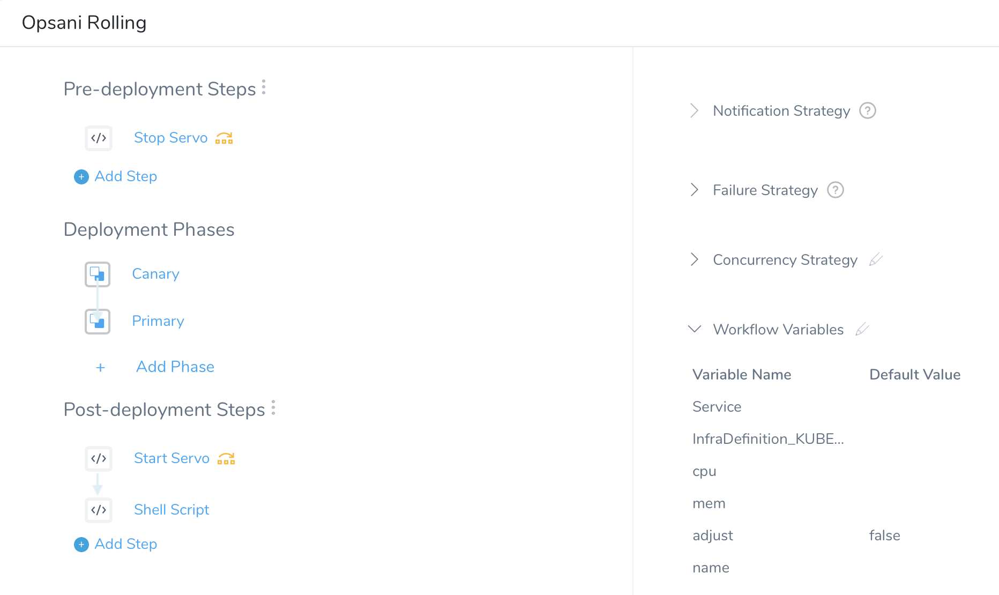
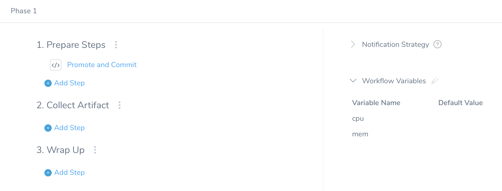
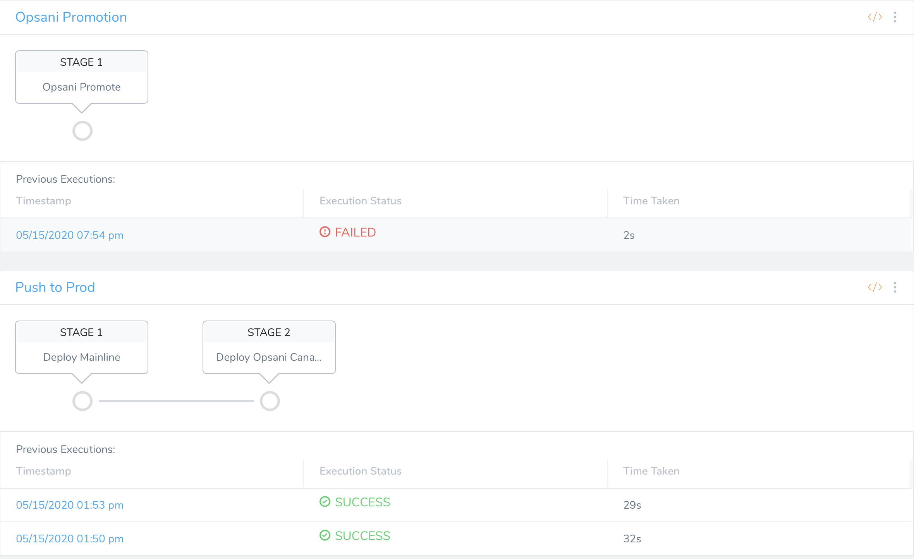
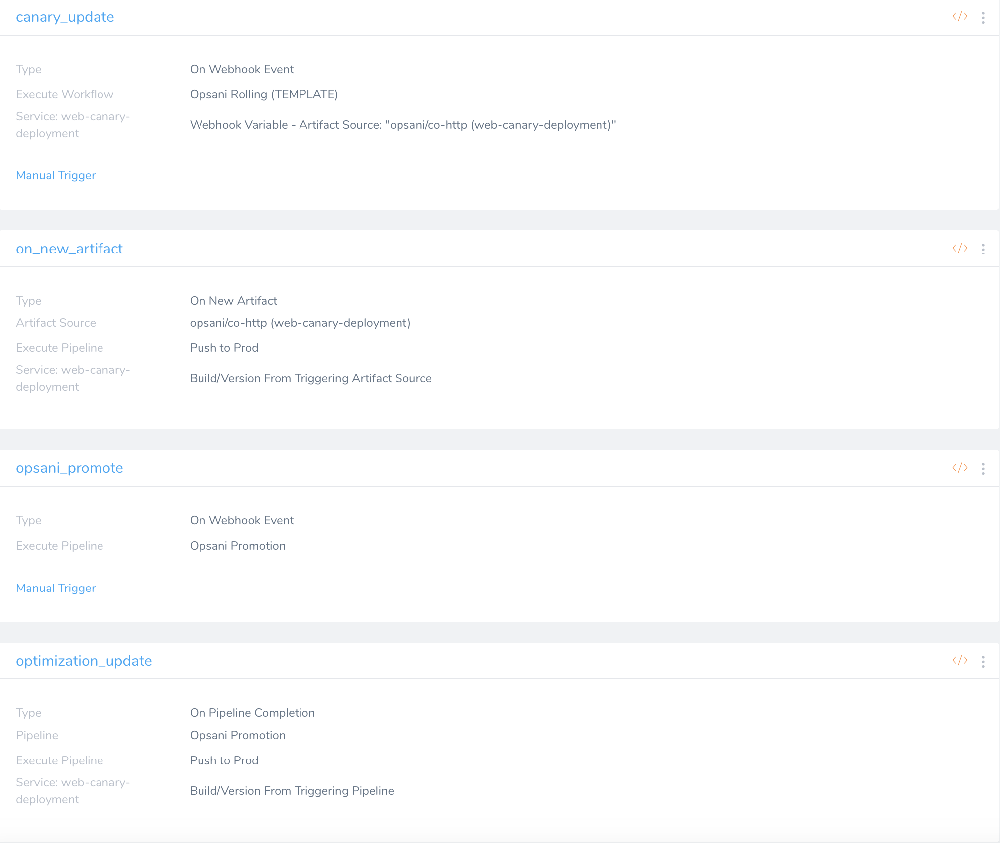
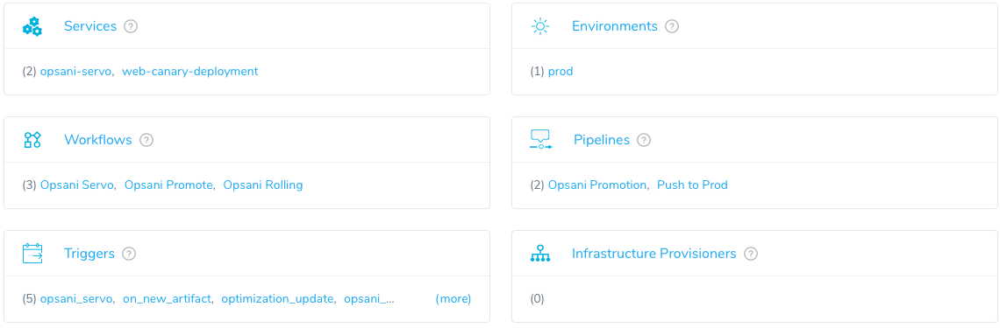

# Opsani Harness integration

This document outlines the basic requirements needed in order to integrate [Opsani Continuious Optimization](https://opsani.com "Opsani") into [Harness](https://harness.io "Harness").

## Secrets

Harness supports a variety of secret providers you may choose to use, though during our testing we simply used the built-in secrets manager to store a text secret named `CO_TOKEN` to store the Opsani token that is used by Harness and the Servo to communicate with the Opsani API.

We also need a secret to store our private SSH key for Github.  In order for Harness to translate the secret text into a usable private key file, the easiest thing to do is to base64 encode it onto a single line:
```bash
cat <ssh_private_key> | base64
```

We can then take that output and store it in the Harness secrets manager, I name mine `github_ssh_key`

You'll see that we then decode it when writing it to a file in our script later on.

## Setup

Add a Source Repo to Harness for the application we'll be working with: `Setup->Connectors->Source Repo Providers` - you'll want to add the webhook displayed in this dialogue to your Git Repo to allow Git to notify Harness of any updates so that it can sync appropiately.

Setup your application: `Setup->Add Applications` - note that the **_Git Sync_** option in this dialogue is for allowing Harness to sync changes that you make within Harness back to the repo.  We'll want this on unless the entire Harness configuration is done programmatically.

Go into the application settings for the application you just created, add your service and point it to an artifact source.  This artifact source being updated will trigger a deploy (we'll set this up in our Triggers further long in this document)

## Workflows

We'll need two main workflows for the integration to work.  Note that there is no dependency on any of the naming conventions we've used throughout this with regard to Workflow names, Pipeline names, Application names, etc... so choose names that make the most sense for you.

#### Opsani Canary Workflow



For the purposes of our testing, we named the first workflow "Opsani Rolling."  This is the workflow responsible for deploying the Opsani Canary, which will be triggered to run through Harness by the Servo as it makes adjustments to resources.

The Opsani required components here are:

Workflow variables for the resources we want to control, a workflow variable for the name of the workflow (this name will also become the instance or pod name.)  In our testing we used `cpu`, `mem`, `name` and `adjust` for our workflow variables here.  The `adjust` variable is something we pass in as `True` when adjustments are being made to the canary and defaults to `False` when a deployment that doesn't update the Opsani Canary is triggered.  The `name` variable has a default value of `canary`.   All workflow variables we've used throughout this are just of type `Text` in Harness.

We'll also need a pre-deployment step here to stop the Servo if we are doing a production deploy.  We can determine this by looking at the `adjust` variable and the `name` variable.    We'll add a pre-deployment step using a Bash script that simply makes a request to the Opsani API asking us to stop the Servo.  Note the use of the secret we setup earlier here:

```bash
curl  -X PATCH -H 'Content-type: application/json' -H 'Authorization: Bearer '${secrets.getValue("CO_TOKEN")}'' 'https://api.optune.ai/accounts/dev.opsani.com/applications/harness-dev/state' -d '{"target_state":"stopped"}'
```

Add a conditional value in Harness to skip this step with this condition is met:

```bash
${workflow.variables.adjust}=="True" or ${workflow.variables.name}=="canary"
```

We'll need to re-create this as a post-deployment step as well, using a different `target_state` to start the servo when the Workflow is wrapping up:

```bash
curl  -X PATCH -H 'Content-type: application/json' -H 'Authorization: Bearer '${secrets.getValue("CO_TOKEN")}'' 'https://api.optune.ai/accounts/dev.opsani.com/applications/harness-dev/state' -d '{"target_state":"running"}'
```
Add the conditional to this step as well:

```bash
${workflow.variables.adjust}=="True" or ${workflow.variables.name}=="canary"
```
#### Opsani Promote Workflow



This Workflow is Triggered via the Servo when we find ideal settings that we want to promote to production and will need variables setup for the resources we plan on managing, for testing we've been using `cpu` and `mem` for these values.  

The workflow has two steps:  

1. An approval step using the built-in approval system in Harness.
2. A Bash script that will install the required dependencies, pull down a custom script that will clone the defined repo, make the necessary adjustments to the resource parameters in the Trigger YAML files and push them back to the repo.  This ensures that when a deploy is triggered outside of the Opsani Workflow, that it happens with the newly decided upon resource values.

Please see the included [opsani_promote_example.sh](../doc/opsani_promote_example.sh) for the script we've been using to manage this.  This pulls down a [gitops_promote_example.sh](../doc/gitops_promote_example.sh) script where the bulk of the operations live.

A few notes on this:

1. The first portion of the script is mostly dependency setup and is something you may want to pull out of here and put into a Delegate Profile script in order to save time by not running unnecessary package installation commands each time.
2. In our example demo, we're just pulling the script down from a private Gist.  You'll probably want to keep your version on your Artifact server, within the Git repo or as part of the Delegate setup.  
3. The Repo name and URL is hardcoded into the script.  Obviously this is not ideal unless you're programmatically setting up these repos.  Harness already knows both the repo name and the URL, but they are not exposed via variables anywhere, it would be nice though if it did.  Then we could use these variables in the script to make it more dynamic.  Possibly a Harness feature request?

#### Pipelines



The pipelines are pretty straightfoward.  We simply need one pipeline that includes the workflow to deploy your mainline application and the canary deployment.  Then a second pipeline to run the Promotion Workflow.

#### Triggers



We'll need four triggers to support and assist with the automation.  Triggers can be defined either via the Harness UI or via YAML files in your applications Harness repo.

1. on_new_artifact

   This is an `on new artifact` type Trigger, pointed to your artifact source.  This triggers a deployment when your artifact is updated via the `Push to Prod` Pipeline and is the primary Trigger we are aiming to update during a Promotion.

   Harness YAML:

```yaml
   harnessApiVersion: '1.0'
   type: TRIGGER
   artifactSelections:
   - regex: false
     serviceName: web-canary-deployment
     type: ARTIFACT_SOURCE
   executionName: Push to Prod
   executionType: Pipeline
   triggerCondition:
   - type: NEW_ARTIFACT
     artifactStreamName: opsani_co-http
     regex: false
     serviceName: web-canary-deployment
   workflowVariables:
   - name: mem
     value: 512Mi
   - name: cpu
     value: 200m
``` 
2. canary_update

   This is an `On Webhook Event` type Trigger with a `Custom` payload that should be setup to execute the `Opsani Rolling` Wrkflow.  Note that we're calling the Workflow directly instead of a Pipeline here.

3. opsani_promote

   This is also an `On Webhook EVent` type Trigger with a `Custom` payload but should be setup to run the `Opsani Promotion` Pipeline you would have configured earlier.

4. optimization_update

   This is an `On Pipeline Completion` type Trigger that should be setup to run after the `Opsani Promotion` Pipeline finishes.  We'll have it automatically run the `Push to Prod` Pipeline automatically when complete.  This ensures that after we make a promotion with new recommended resource values, that we then deploy to production with the new values.

#### Servo

More incoming, but the Servo install should be as simple as running
```bash
kubectl apply -f <servo.yaml>
```

#### Summary



The [../doc/harness_yaml/](../doc/harness_yaml) directory conatains a copy of all the YAML that Harness generated for the above scenario for reference.  If you have any questions/comments/feedback please reach out to me | ben@opsani.com
